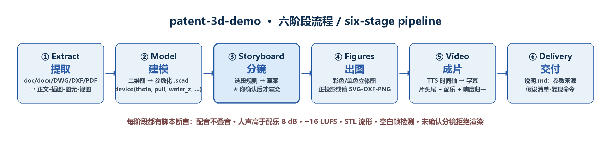
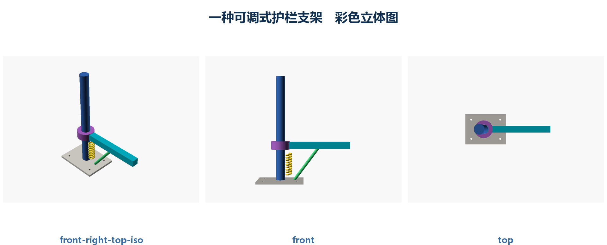
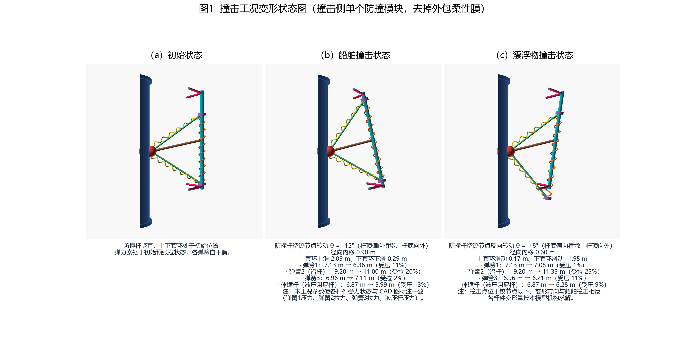
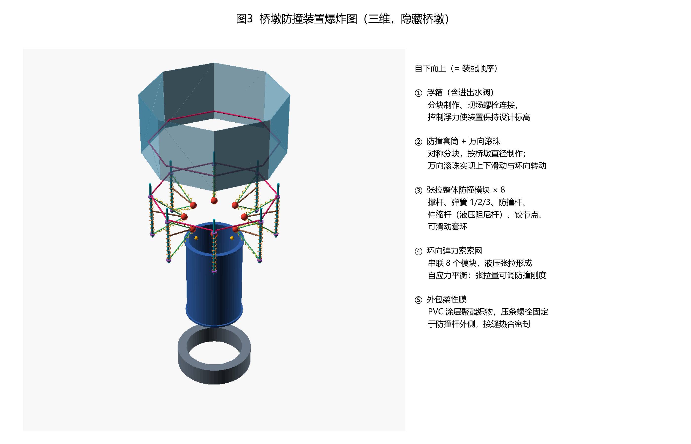
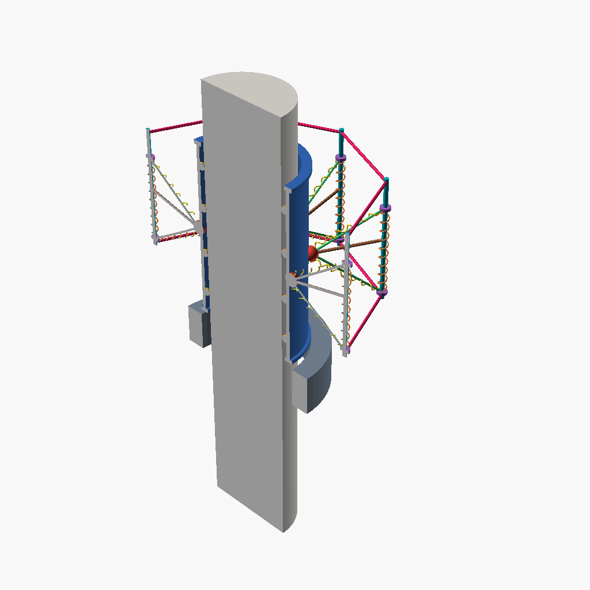

# patent-3d-demo —— 专利三维演示技能

[](https://github.com/Jkcode8/patent-3d-demo/actions/workflows/regression.yml)
[](LICENSE)

**English**: [README.md](README.md)

把**专利交底书 + CAD 图纸**变成**参数化三维模型、彩色/黑白附图、配音演示视频**的**智能体技能**
（适用于 Codex、Claude Code 及其他支持 skills 的智能体运行时）。



## 为什么做这个

专利交底书里的结构、原理与施工方法，用三维视频讲比文字有效得多；但手工做既慢又难复现。
本技能把整条链路固化成可重复执行的流程，并把**实际踩过的坑写成断言**，而不是留到成片才发现。

## 产出什么

| 阶段 | 产出 |
|---|---|
| ① 提取 | 交底书正文与插图、CAD 图元与文字标注、图纸各视图 PNG |
| ② 建模 | 参数化 `.scad`（统一 `device(theta, pull, water_z, step, explode, section)` 接口）+ 流形 STL，并与原始图纸叠合核对比例 |
| ③ 分镜 | 由交底书推导段落草案，**经你确认后才渲染**（门禁） |
| ④ 出图 | 彩色立体图、单色立体图、正投影线稿（SVG / **DXF** / PNG）+ 参数表 |
| ⑤ 成片 | 逐句 TTS → 时间轴 → 字幕 → 片头片尾 → 配乐闪避 → 响度归一 MP4 |
| ⑥ 交付 | `说明.md`：参数来源、假设清单、复现命令 |

## 示例产出（虚构示例，随仓库提供用于回归）



## 实战案例：桥墩防撞装置



| | |
|---|---|
|  |  |

完整内容见 [`cases/pier-anticollision/`](cases/pier-anticollision/README.md)：模型源码、附图、配色图例、装配顺序图与 38 秒成片样片。

## 环境要求

- **OpenSCAD**（必需），可用 `OPENSCAD_EXECUTABLE` 指定路径
- 可选（各有降级路径）：`ffmpeg`（无则只出 GIF）、`edge-tts` + 网络（无则用 Windows SAPI 语音）、
  `numpy` / `Pillow` / `ezdxf`、AutoCAD（无则改读 DXF）

```bash
python scripts/config.py --check     # 逐项给出可用性与降级方案
```

## 安装

```bash
# Codex
git clone https://github.com/Jkcode8/patent-3d-demo.git "${CODEX_HOME:-$HOME/.codex}/skills/patent-3d-demo"
# Claude Code / 其他支持 skills 的智能体：放进各自的 skills 目录
git clone https://github.com/Jkcode8/patent-3d-demo.git ~/.claude/skills/patent-3d-demo
```

## 快速开始

```bash
SKILL=~/.codex/skills/patent-3d-demo
python $SKILL/scripts/config.py init-project <项目目录>
# 把交底书/图纸放进 <项目目录>/原始资料/ 后：
python $SKILL/scripts/extract_docx.py <交底书.docx> <项目>/_extract
powershell -File $SKILL/scripts/extract_dwg.ps1 -OutDir <项目>/_extract -DwgPath <图.dwg>
python $SKILL/scripts/render_sketch.py <项目>/_extract

# 建模：以 assets/model_lib.scad 为骨架，在 <项目>/model/device.scad 实现 device(...)
python $SKILL/scripts/storyboard.py draft   <项目>    # 分镜草案 + 旁白草稿
python $SKILL/scripts/storyboard.py confirm <项目>    # 门禁：不确认不渲染
python $SKILL/scripts/narration.py tts      <项目> --voice female|male
python $SKILL/scripts/storyboard.py render  <项目>    # 逐段渲染，帧缓存增量
python $SKILL/scripts/make_figures.py       <项目>
python $SKILL/scripts/narration.py compose  <项目>
python $SKILL/scripts/final_film.py         <项目>
python $SKILL/scripts/make_delivery.py      <项目>

# 自检
python $SKILL/scripts/verify_vs_drawing.py  <项目> --views front,top
python -m unittest discover -s tests -t .              # 纯函数单测，不需要 OpenSCAD/ffmpeg
```

## 目录结构

```
patent-3d-demo/
├── SKILL.md            技能主体：触发条件、六阶段、产出、不变量
├── CHANGELOG.md        版本历史（与 SKILL.md 的版本号由单测强制一致）
├── .gitattributes      统一 LF，二进制资源按类型声明
├── agents/openai.yaml  UI 元数据
├── references/         提取/建模/分镜/附图/视频/踩坑清单（按需读取）
├── scripts/            21 个脚本（提取、渲染、分镜、配音、成片、校验）
├── tests/              纯函数单元测试（秒级，无外部依赖）
├── assets/             模型骨架 · 8 类段落模板 · 脱敏示例（含期望产出）
├── cases/              实战案例
└── docs/images/        README 配图
```

## 内置不变量（脚本主动断言）

每句配音 ≤ 其时间槽（防叠音）· 人声高于配乐 ≥ 8 dB · 整片 −16 LUFS ±1 · STL 流形 ·
**空白帧检测**（曾因 include 静默失败产出一整部白片）· 分镜未确认拒绝渲染 ·
模型正投影与原图长宽比偏差 ≤ 6% 且轮廓覆盖率 ≥ 60% ·
`SKILL.md` / `CHANGELOG.md` / `config.VERSION` 三处版本号一致。

## 可选增强

| 需求 | 用法 |
|---|---|
| 英文 / 多语种配音 | `narration.py tts <项目> --language en-US`（声线自动切 `en-US-*`，字幕仍用原文） |
| 数字与单位读法规范化 | 默认开启：`φ1500`→"直径1500"、`1.5m`→"1.5米"、`16+16+17度`→"16度、16度、17度"、`−2.26m`→"负2.26米"（只改送合成文本） |
| 剖切轮廓线稿 | `lineart.py … --sections 2`（按高度均分切割，含外轮廓 + 剖切轮廓） |
| 爆炸状态线稿 | `lineart.py … --exploded <分离量>` |
| 图题与尺寸线 | `lineart.py` 默认给 PNG 加图题与总宽/总高标注 |
| 模板烟测 | `check_templates.py <项目> --frames 2 --render adjust`（8 类模板逐个实例化 + 语法/渲染） |
| 离线成片（无 TTS） | `make_stub_narration.py <项目>` 生成占位旁白，再走 compose / final_film |
| 技能结构自检 | `check_skill_md.py .` |
| **模型↔图纸核对** | `verify_vs_drawing.py --project <项目> [--drawing 立面.dxf] [--views front,top]` → 三栏比对图（原图｜模型投影｜叠加）+ `核对报告.json`（长宽比偏差 / 覆盖率 / IoU） |
| **单元测试** | `python -m unittest discover -s tests -t .` —— 35 项断言，1 秒内跑完，不需要 OpenSCAD/ffmpeg |

**帧缓存**：`storyboard.py render` 把"实例化段落文件 + `-D` 参数 + 渲染设置"哈希存入
`video/frames/<id>/_cache.json`，模型或参数一变即重渲；此前只比对帧数，可能静默复用旧帧。

## 示例与 CI

`assets/example_simple/` 是虚构的「可调式护栏支架」，含模型、分镜与期望产出。
`regression.yml` 每次 push 先跑单元测试、再重跑它（含空白帧检测与图纸叠合核对）；
`full-pipeline.yml` 按需/每周跑一次带配音的完整成片。

## 说明

- 仓库内示例为**虚构装置**；案例为真实项目，经作者同意收录。
- 配乐默认由脚本合成；放入 `音乐/` 或用 `--music` 指定自有曲子即可（自动电平归一 + 旁白闪避）。

## License

MIT
