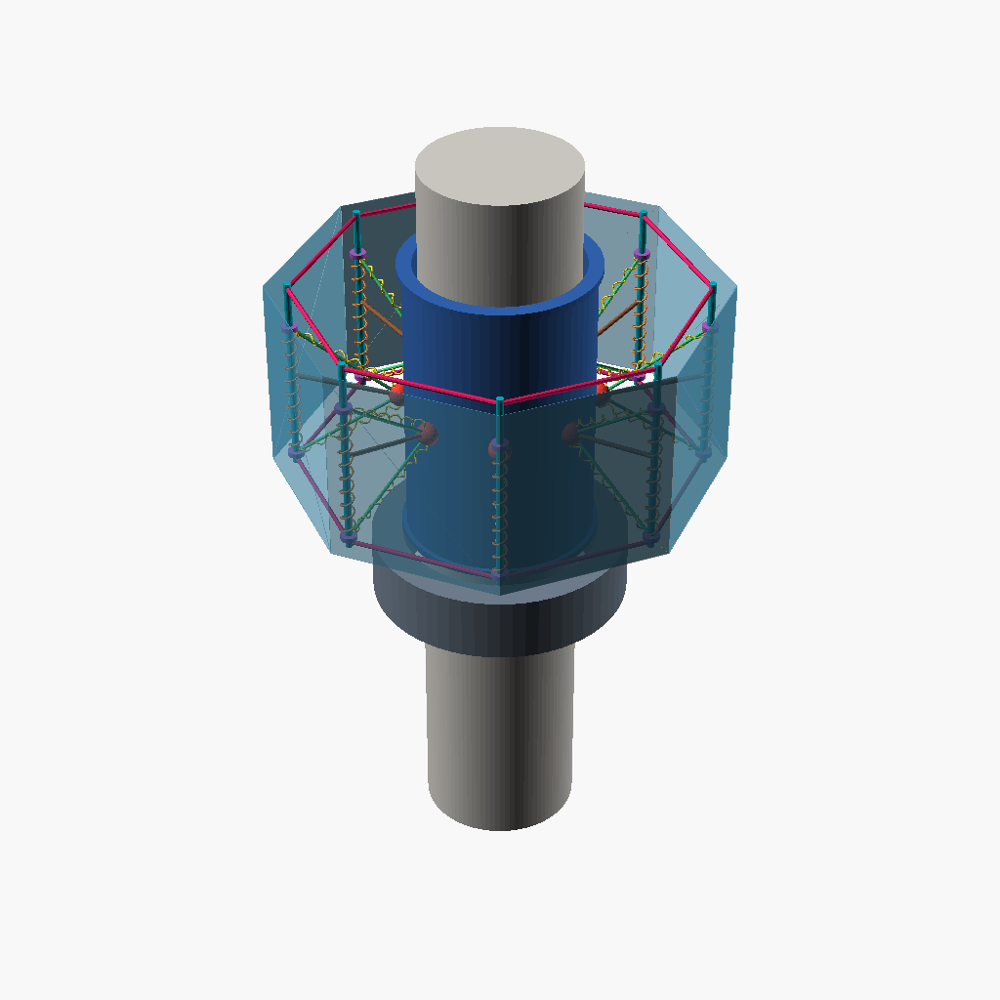
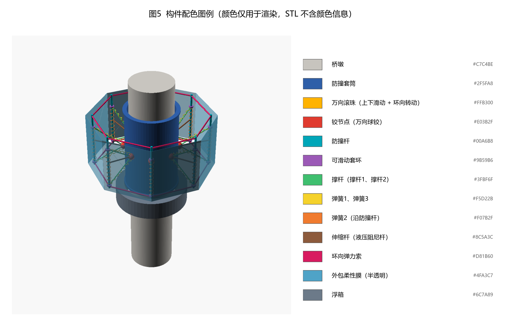

# 案例：一种自适应多重耗能桥墩防撞装置

> 用 `patent-3d-demo` 从**专利交底书 + CAD 图**做出来的一套三维模型、附图与配音演示视频。
> 原始交底书与 DWG 未收录在本仓库（涉及未公开专利内容）；仓库内保留模型源码、附图、成片样片。

## 装置是什么

环向布置 **8 个张拉整体防撞模块**：每个模块由撑杆、弹簧 1/2/3、防撞杆、伸缩杆（液压阻尼杆）、
铰节点与可滑动套环组成；模块之间用**环向弹力索**串联成自应力平衡索网；
**防撞套筒 + 万向滚珠**让装置沿桥墩上下滑动并可环向转动；**浮箱**随水位调节标高；
外侧覆盖**外包柔性膜**保护船舶。撞击时"弹簧拉压 + 伸缩杆 + 旋转 + 滑动"多路径耗能。



## 从图纸得到的几何量（单位 mm）

| 参数 | 取值 | 来源 |
|---|---|---|
| 桥墩半径 | 5000 | 平面图 R5000 |
| 防撞套筒内/外半径 | 5600 / 6000 | 平面图 R5600、R6000 |
| 8 个铰节点所在半径 | 12 900 | 平面图 8 个节点圆（45° 均布） |
| 防撞杆长度 | 13 000 | 立面图 |
| 浮箱环 | R6300~8300 | 平面图浮箱环 + 立面图宽 16 000 |
| 构件配色 | 13 类 | 见 `images/case-color-legend.png` |

## 成果

| 输出 | 文件 |
|---|---|
| 参数化模型（含机构运动学解算） | `model/*.scad`（`anticollision_lib.scad` 为公共库） |
| 撞击工况变形状态图（含杆件变形数值） | `images/case-impact-deformation.png` |
| 撞击侧局部放大变形 | `images/case-impact-zoom.png` |
| 爆炸图 | `images/case-exploded.png` |
| 半剖（显示万向滚珠与套筒） | `images/case-section.png` |
| 装配顺序图 | `images/case-assembly.png` |
| 构件配色图例 | `images/case-color-legend.png` |
| 成片样片（38 s，含片头、转台、撞击与配乐） | `demo-sample.mp4` |

## 两个值得记录的细节

1. **机构是解算出来的，不是摆出来的**：防撞杆通过两根定长撑杆与铰节点相连，端部是沿杆滑动的
   套环；给定转角与径向内移后，套环位置由 `|C + t·u − H| = L` 解出，各弹簧的拉压与伸缩杆行程
   都是几何结果。用 `scripts/check_kinematics.py` 扫描参数，找到与图纸标注一致的组合
   （−12°、内移 900 mm 时"弹簧1 压、弹簧2/3 拉、阻尼压"四项全部吻合）。
2. **配色让结构讲得清楚**：13 类构件各自配色（防撞杆青、套环紫、铰节点红、撑杆绿、弹簧黄/橙、
   阻尼棕、索洋红、外包膜半透明天蓝…），一张图就能说清"谁是谁"。



## 复现

```bash
SKILL=~/.codex/skills/patent-3d-demo
python $SKILL/scripts/config.py init-project <你的项目>
cp -r model/*.scad <你的项目>/model/
# 按 SKILL.md 的六阶段依次执行（分镜可直接改写 storyboard.json 的 narration）
```
